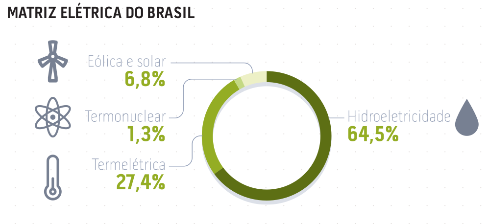
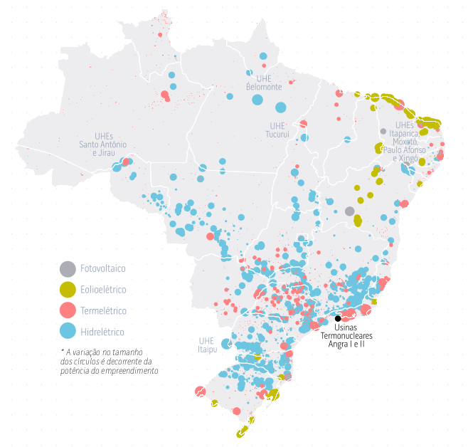
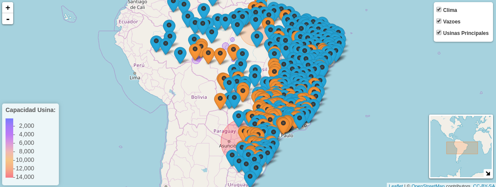
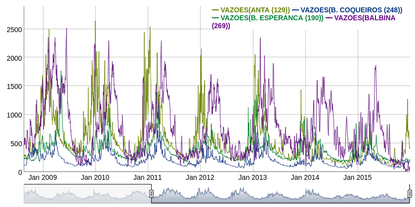
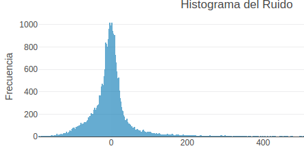
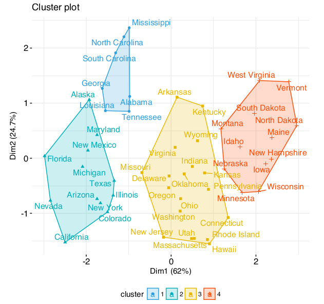

```{r,echo=FALSE, message=FALSE, warning=FALSE}
library(knitr)
library(xts)
library(TSclust)
library(TSdist)
library(smacof)
library(factoextra)
library(dygraphs)
library(plotly)

load('Data/Vazoes_Profit.RData')

knitr::opts_chunk$set(echo = FALSE,message=FALSE, warning=FALSE)
#opts_chunk$set(echo = TRUE, eval = FALSE, message=FALSE, warning=FALSE)
```

# Antecedentes

<p>  </p>


## Antecedentes

Brasil tiene una de los sistemas hidrológicos más complejos, diversos y extensos del mundo.
A diferencia de la gran mayorı́a de los paı́ses desarrollados, Brasil tiene en los rı́os su principal fuente de generación de electricidad , ocupando el tercer lugar dentro de los más grandes productores hidroeléctricos del mundo. Debido a la importancia del sector hidroeléctrico,
buscar formas de facilitar y mejorar el modelamiento de datos asociados a este sector es un
problema prioritario.

<p align="center">  </p>

##
#### Fuentes de Generación de Energía

<p align="center">  </p>


## Problema

Una de las posibles problemáticas en el modelamiento de estos datos es lidiar con la enorme cantidad de datos asociados a mediciones de Caudales de los rı́os que componen este sistema, que cuenta con alrededor de 150 estaciones de medición repartidas en todo Brasil. Dichos datos se presentan en forma de Series de Tiempo que posee tres carácteristicas que dificultan su análisis, como:

- La primera es que estas series de tiempo poseen observaciones diarias de los caudales en un periodo de tiempo de alrededor de 30 años, es decir, son series muy extensas. 
- La segunda caracterı́stica es que estas series de tiempo son estacionals.
- Por último existe evidencia de que el ruido o error asociado a estas series no se distribuye normalmente sino que su distribución posee colas más pesadas como las analizadas en teorı́a de valores extremos.

## Problema

<p align="center">  </p>
<p align="center"> 
   
  
</p>


## Problema

En este contexto, notamos que es posible disminuir la dimensión del problema a travéz
la identificación de clústers o zonas representativas (no necesariamente geográficas) que
resuman el comportamiento temporal que poseen los caudales de los rı́os. Esto en términos
de modelamiento esto se traduce en pasar del problema de modelar el nivel de caudal en
todas las 150 estaciones, al problema de modelar unicamente 1 estación por cada clúster.


## Análisis Clúster

#### Ideas Introductorias

El Análisis Clúster es un técnica de aprendizaje no supervisado que tiene como objetivo dividir un conjunto de objetos en grupos homogéneos (clústers). La partición se realiza de tal manera que los objetos en un mismo "clúster"" son más "similares" entre sí que dos objetos en diferentes clústers.

<p align="center">  </p>


##
 
### Medidas de Similitud y Disimilitud

Desde un punto de vista general el término proximidad indica el concepto de cercanı́a en espacio, tiempo o cualquier otro contexto. Desde un punto de vista matemático, ese término hace referencia al concepto de disimilaridad o similaridad entre dos elementos. 

Sea O un conjunto finito o infinito de elementos (individuos, estímulos, sujetos u objetos) sobre los que queremos definir una proximidad. Dados dos elementos $o_i$ y $o_j$ de este conjunto, diremos que la función $\delta: O\times O \rightarrow \mathbb{R}$ es una función de disimilitud si cumple:

- $\delta(o_i,o_j) = \delta(o_j,o_i)$
- $\delta(o_i,o_i) \le\delta(o_i,o_j)$
- $\delta(o_i,o_i) = \delta_0$

Convencionalmente se considera $\delta_0=0$. 

**Observación.** Es posible transformar una función de disimilaridad en una métrica (distancia), forzandola a cumplir a desigualdad triangular.


##
### Medidas de Disimilitud

#### Ejemplos

Para $X,Y\in \mathbb{R}^n$ se definen las siguientes funciones:

- Métrica Euclidea 
\[
d_{euc}(X,Y)=\sqrt{\sum_{t\in n}(x_t-y_t)^2}
\]

- Métrica de Minkowski

\[
d_{mink}(X,Y)=\sqrt[p]{\sum_{t\in n}(x_t-y_t)^p}
\]

- Norma Infinito

\[
d_{inf}(X,Y)=\underset{t\in n}{\max} |x_t-y_t|
\]

## Escalonamiento Multidimensional (MDS)

Es un conjunto de técnicas que permiten visualizar un conjunto de objetos en un espacio de dimensión $N$ ($N=2$ o $3$ usualmente, y definida a priori), esto a partir de una matriz de disimilitud (similitud o distancia) entre dichos objetos.

MDS es usualmente es usada como una técnica de reducción de dimensiones, es decir, representar objetos que se encuentran en un espacio de una dimensión alta ($N\ge 4$) en un espacio de dimensión menor ($N=2$) (como el Análisis de Componentes Principales, Factorial, entre otros). 


## Metodología

Primero construimos la matriz de distacias entre las series de tiempo asociadas a los `CAUDALES`, para ello escogemos una de las métricas definidas para series de tiempo. Luego, a partir de la matriz de distancias utilizamos la técnica de MDS clásica, a partir de ella se obtiene una nube de puntos (en dimensión $N=2$) donde cada punto representa a la serie de `CAUDALES` de una estación.

A partir de esta nube de puntos en dimensión $N=2$, usamos el Análisis Clúster  para crear grupos de puntos basandose en su cercanía (esta cercanía depende fundamentalmente de la métrica elegida).

Algunos de los resultados obtenidos de haber escojido una métrica específica se muestran a continuación.

# Aplicación

## Métrica Euclidea 

Sean $(X_t)$, $(Y_t)$ dos series de tiempo, a valores en $\mathbb{R}$, con $t\in T$. Se definen entonces las siguientes métricas (distancias).

\[
d_{euc}(X_t,Y_t)=\sqrt{\sum_{t\in T}(x_t-y_t)^2}
\]

```{r Euclidea, fig.height=3.5, fig.align='center'}
D<-D_euc
k_aux<-2

#Cluster Óptimo   --------------
map<-smacofSym(D)
op<-fviz_nbclust(map$conf, kmeans, method = "silhouette")
#op
ggplotly(op)

#Dendograma -------
clus<-hclust(D)
dn<-fviz_dend(clus, k = k_aux, # Cut in 5 groups
          cex = 0.6, horiz=F,# label size
          k_colors = c("#6C3483", "#00AFBB", "#E7B800", "#FC4E07", "#00FF00","#283747"),
          color_labels_by_k = TRUE, # color labels by groups
          rect = TRUE # Add rectangle around groups
)
#dn
#ggplotly(dn)

grup <- cutree(clus, k = k_aux)

#Nube de puntos ---------
p<-fviz_cluster(list(data = map$conf, cluster = grup),labels_cex=0.3,
             palette = c("#6C3483", "#00AFBB", "#E7B800", "#FC4E07", "#00FF00","#283747"),
             ellipse.type = "convex", # Concentration ellipse
             repel = FALSE, # Avoid label overplotting (slow)
             show.clust.cent = FALSE, ggtheme = theme_minimal())

#p
#ggplotly(p)


# -------------------------------------------------
excl<-which(is.na(vazoes_code$Latitud))
D1<-as.numeric(map$conf[,'D1']);#D1<-D1[-excl]
D2<-as.numeric(map$conf[,'D2']);#D2<-D2[-excl]

BDD_profit<-data.frame(Nombre_ST = paste0('VAZOES(',vazoes_code$Estacion,')'),
                       Estacion=vazoes_code$Estacion,
                       Codigo_ONS=vazoes_code$Codigo_ONS,
                       Latitud=vazoes_code$Latitud,
                       Longitud=vazoes_code$Longitud,
                       D1, D2, Cluster=as.factor(as.character(grup))
)

#BDD_profit<-BDD_profit[-excl,]

# Grafico de Series por Cluster ---------
est_cluster1<-as.character(BDD_profit$Nombre_ST[BDD_profit$Cluster==1])
est_cluster2<-as.character(BDD_profit$Nombre_ST[BDD_profit$Cluster==2])

aux_vaz_dy<-vazoes_profit_ts
names(aux_vaz_dy)<-names(vazoes_profit)[-1]

#Series Cluster1

dy1 = dygraph(aux_vaz_dy[,est_cluster1[1:5]], main = "Series del Cluster 1",group = 'euclideo')%>%
  dyRangeSelector(dateWindow = c('2010-01-01','2015-12-31'))%>%
  dyHighlight(highlightSeriesBackgroundAlpha = 0.3)%>%
  dyLegend(show='always')

#Series Cluster2
dy2 = dygraph(aux_vaz_dy[,est_cluster2[1:5]], main = "Series del Cluster 2",group = 'euclideo')%>%
  dyRangeSelector(dateWindow = c('2010-01-01','2015-12-31'))%>%
  dyHighlight(highlightSeriesBackgroundAlpha = 0.3)%>%
  dyLegend(show='always')


```

## Nube de "objetos"

```{r fig.height=4, fig.align="center"}
ggplotly(p)
```


## Series de cada Cluster
```{r fig.height=2.7, fig.width=6, fig.align='center'}
dy1
dy2
```


## Métrica de Minkowski

\[
d_{mink}(X_t,Y_t)=\sqrt[p]{\sum_{t\in T}(x_t-y_t)^p}
\]

```{r Minkowski}
D<-D_mink
k_aux<-2

#Cluster Óptimo   --------------
map<-smacofSym(D)
op<-fviz_nbclust(map$conf, kmeans, method = "silhouette")
#op
ggplotly(op)

#Dendograma -------
clus<-hclust(D)
dn<-fviz_dend(clus, k = k_aux, # Cut in 5 groups
          cex = 0.6, horiz=F,# label size
          k_colors = c("#6C3483", "#00AFBB", "#E7B800", "#FC4E07", "#00FF00","#283747"),
          color_labels_by_k = TRUE, # color labels by groups
          rect = TRUE # Add rectangle around groups
)
#dn
#ggplotly(dn)

grup <- cutree(clus, k = k_aux)

#Nube de puntos ---------
p<-fviz_cluster(list(data = map$conf, cluster = grup),labels_cex=0.3,
             palette = c("#6C3483", "#00AFBB", "#E7B800", "#FC4E07", "#00FF00","#283747"),
             ellipse.type = "convex", # Concentration ellipse
             repel = FALSE, # Avoid label overplotting (slow)
             show.clust.cent = FALSE, ggtheme = theme_minimal())

#p
#ggplotly(p)


# -------------------------------------------------
excl<-which(is.na(vazoes_code$Latitud))
D1<-as.numeric(map$conf[,'D1']);#D1<-D1[-excl]
D2<-as.numeric(map$conf[,'D2']);#D2<-D2[-excl]

BDD_profit<-data.frame(Nombre_ST = paste0('VAZOES(',vazoes_code$Estacion,')'),
                       Estacion=vazoes_code$Estacion,
                       Codigo_ONS=vazoes_code$Codigo_ONS,
                       Latitud=vazoes_code$Latitud,
                       Longitud=vazoes_code$Longitud,
                       D1, D2, Cluster=as.factor(as.character(grup))
)

#BDD_profit<-BDD_profit[-excl,]

# Grafico de Series por Cluster ---------
est_cluster1<-as.character(BDD_profit$Nombre_ST[BDD_profit$Cluster==1])
est_cluster2<-as.character(BDD_profit$Nombre_ST[BDD_profit$Cluster==2])

aux_vaz_dy<-vazoes_profit_ts
names(aux_vaz_dy)<-names(vazoes_profit)[-1]

#Series Cluster1

dy1=dygraph(aux_vaz_dy[,est_cluster1[1:5]], main = "Series del Cluster 1",group = 'minkows')%>%
  dyRangeSelector(dateWindow = c('2010-01-01','2015-12-31'))%>%
  dyHighlight(highlightSeriesBackgroundAlpha = 0.3)%>%
  dyLegend(show='always')

#Series Cluster2
dy2=dygraph(aux_vaz_dy[,est_cluster2[1:5]], main = "Series del Cluster 2",group = 'minkows')%>%
  dyRangeSelector(dateWindow = c('2010-01-01','2015-12-31'))%>%
  dyHighlight(highlightSeriesBackgroundAlpha = 0.3)%>%
  dyLegend(show='always')


```

## Nube de "objetos"

```{r fig.height=4, fig.align="center"}
ggplotly(p)
```


## Series de cada Cluster

```{r fig.height=2.7, fig.width=6, fig.align='center'}
dy1
dy2
```


## Series de Tiempo

En esta sección mostramos resultados obtenidos al considerar métricas que consideran la correlación en y entre las series.

#### Disimilitud basada en la Autocorrelación

\[
d_{acf}(X_t,Y_t)=\sqrt{(\hat\rho_x-\hat\rho_y)^t\Omega(\hat\rho_x-\hat\rho_y)}
\]

donde $\hat\rho_x$ es el vector con los coeficientes de autocorrelación.

#### Disimilitud basada en Correlación

\[
d_{cor}(X_t,Y_t)=\sqrt{\left( \frac{1-\rho}{1+\rho} \right)^\beta}
\]

donde $\rho$ es el coeficiente de correlación de Pearson entre las series, y $\beta$ se define a priori.

## Series de Tiempo

#### Distacia basada en la Correlación Cruzada

\[
d_{ccor}(X_t,Y_t)=\sqrt{\frac{(1-CC(x_t,y_t,0))^2}{\sum_{k}(1-CC(x_t,y_t,k))^2}}
\]

Donde $CC(x_t,y_t,k)$ es la función de correlación cruzada con $k$ retardos.


## Disimilitud basada en la Autocorrelación

```{r Autocorrelacion}
D<-D_acf
k_aux<-4

#Cluster Óptimo   --------------
map<-smacofSym(D)
op<-fviz_nbclust(map$conf, kmeans, method = "silhouette")
#op
#ggplotly(op)

#Dendograma -------
clus<-hclust(D)
dn<-fviz_dend(clus, k = k_aux, # Cut in 5 groups
          cex = 0.6, horiz=F,# label size
          k_colors = c("#6C3483", "#00AFBB", "#E7B800", "#FC4E07", "#00FF00","#283747"),
          color_labels_by_k = TRUE, # color labels by groups
          rect = TRUE # Add rectangle around groups
)
#dn
#ggplotly(dn)

grup <- cutree(clus, k = k_aux)

#Nube de puntos ---------
p<-fviz_cluster(list(data = map$conf, cluster = grup),labels_cex=0.3,
             palette = c("#6C3483", "#00AFBB", "#E7B800", "#FC4E07", "#00FF00","#283747"),
             ellipse.type = "convex", # Concentration ellipse
             repel = FALSE, # Avoid label overplotting (slow)
             show.clust.cent = FALSE, ggtheme = theme_minimal())

#p
#ggplotly(p)


# -------------------------------------------------
excl<-which(is.na(vazoes_code$Latitud))
D1<-as.numeric(map$conf[,'D1']);#D1<-D1[-excl]
D2<-as.numeric(map$conf[,'D2']);#D2<-D2[-excl]

BDD_profit<-data.frame(Nombre_ST = paste0('VAZOES(',vazoes_code$Estacion,')'),
                       Estacion=vazoes_code$Estacion,
                       Codigo_ONS=vazoes_code$Codigo_ONS,
                       Latitud=vazoes_code$Latitud,
                       Longitud=vazoes_code$Longitud,
                       D1, D2, Cluster=as.factor(as.character(grup))
)

#BDD_profit<-BDD_profit[-excl,]

# Grafico de Series por Cluster ---------
est_cluster1<-as.character(BDD_profit$Nombre_ST[BDD_profit$Cluster==1])
est_cluster2<-as.character(BDD_profit$Nombre_ST[BDD_profit$Cluster==2])
est_cluster3<-as.character(BDD_profit$Nombre_ST[BDD_profit$Cluster==3])
est_cluster4<-as.character(BDD_profit$Nombre_ST[BDD_profit$Cluster==4])

aux_vaz_dy<-vazoes_profit_ts
names(aux_vaz_dy)<-names(vazoes_profit)[-1]


#Series Cluster1
dy1=dygraph(aux_vaz_dy[,est_cluster1[1:5]], main = "Series del Cluster 1",group = 'autocorrela')%>%
  dyRangeSelector(dateWindow = c('2010-01-01','2015-12-31'))%>%
  dyHighlight(highlightSeriesBackgroundAlpha = 0.3)%>%
  dyLegend(show='always')
#Series Cluster2
dy2=dygraph(aux_vaz_dy[,est_cluster2[1:5]], main = "Series del Cluster 2",group = 'autocorrela')%>%
  dyRangeSelector(dateWindow = c('2010-01-01','2015-12-31'))%>%
  dyHighlight(highlightSeriesBackgroundAlpha = 0.3)%>%
  dyLegend(show='always')
#Series Cluster2
dy3=dygraph(aux_vaz_dy[,est_cluster3[1:5]], main = "Series del Cluster 3",group = 'autocorrela')%>%
  dyRangeSelector(dateWindow = c('2010-01-01','2015-12-31'))%>%
  dyHighlight(highlightSeriesBackgroundAlpha = 0.3)%>%
  dyLegend(show='always')
#Series Cluster2
dy4=dygraph(aux_vaz_dy[,est_cluster4[1:5]], main = "Series del Cluster 4",group = 'autocorrela')%>%
  dyRangeSelector(dateWindow = c('2010-01-01','2015-12-31'))%>%
  dyHighlight(highlightSeriesBackgroundAlpha = 0.3)%>%
  dyLegend(show='always')

```


#### Nube de "objetos"

```{r fig.height=4, fig.align="center"}
ggplotly(p)
```


##

```{r fig.height=2.7, fig.width=6, fig.align='center'}
dy1
dy2
```

## 

```{r fig.height=2.7, fig.width=6, fig.align='center'}
dy3
dy4
```

# Modelamiento

## 

<p align="center">  </p>

## 

<p align="center">  </p>
